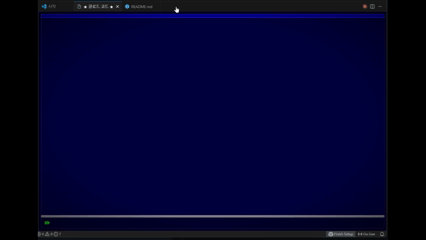

```
╔══════════════════════════════════════════════════════════════╗
║                                                              ║
║    ██████  ███████ ████████ ██████   ██████                  ║
║    ██   ██ ██         ██    ██   ██ ██    ██                 ║
║    ██████  █████      ██    ██████  ██    ██                 ║
║    ██   ██ ██         ██    ██   ██ ██    ██                 ║
║    ██   ██ ███████    ██    ██   ██  ██████                  ║
║                                                              ║
║    ██████  ██████  ███████                                   ║
║    ██   ██ ██   ██ ██                                        ║
║    ██████  ██████  ███████                                   ║
║    ██   ██ ██   ██      ██                                   ║
║    ██████  ██████  ███████                                   ║
║                                                              ║
║           T  E  R  M  I  N  A  L                             ║
║                                                              ║
║    90s Korean BBS-style terminal for VS Code                 ║
║    with AI-powered development tools                         ║
║                                                              ║
╚══════════════════════════════════════════════════════════════╝
```

> **Retro BBS Terminal** brings the nostalgic aesthetics of 1990s Korean
> PC통신 (PC-Tongsin) — Hitel, Naunuri, Chollian — into your VS Code
> editor, packed with modern AI development tools powered by Claude Code CLI.

<p align="center">
  
</p>

---

## Features

### CRT Display Effects

Authentic CRT monitor simulation with scanlines, vignette darkening,
and phosphor text glow — just like the real thing.

### 3 Classic Themes

| Theme                  | Style                               |
| ---------------------- | ----------------------------------- |
| **하이텔 (Hitel)**     | Blue background + Yellow/Cyan text  |
| **나우누리 (Naunuri)** | Black background + Green terminal   |
| **천리안 (Chollian)**  | Navy background + White/Orange text |

### AI Development Tools (Claude Code CLI)

10 AI-powered tools integrated through Claude Code CLI:

| #   | Tool             | Description                                   |
| --- | ---------------- | --------------------------------------------- |
| 21  | Claude Chat      | Interactive chat with conversation context    |
| 22  | Code Review      | Bug detection, improvements, security issues  |
| 23  | Code Explain     | Line-by-line explanation of active file       |
| 24  | Commit Message   | Auto-generate conventional commit messages    |
| 25  | Project Analysis | Tech stack, structure, feature overview       |
| 26  | Security Audit   | OWASP Top 10 vulnerability scanning           |
| 27  | Test Generation  | Auto-generate unit tests (Jest, pytest, etc.) |
| 28  | Git Summary      | Human-readable changelog from git history     |
| 29  | Error Solver     | Paste an error → get diagnosis + fix          |
| 30  | Ask Code         | Ask questions about selected code             |

### Built-in Utilities

- **Project Explorer** — Browse workspace files
- **Git Status/Log** — View repository state
- **Terminal** — Launch VS Code terminal
- **Todo List** — Task management with add/done/del
- **Memos** — Persistent notes with editing
- **Bookmarks** — Save and jump to file locations

### Menu Customization

Fully customizable menus with simple commands:

```
add <key> <category> <label>    Add a custom menu item
del <key>                       Delete a custom item
hide <key>                      Hide a built-in item
show <key>                      Unhide a hidden item
cat                             List all custom/hidden items
```

Custom menus and preferences persist across sessions via workspace storage.

---

## Keyboard Shortcuts

| Key            | Action                |
| -------------- | --------------------- |
| `Ctrl+Shift+B` | Open Retro BBS        |
| Number keys    | Navigate menus        |
| `P`            | Go back (parent menu) |
| `T`            | Go to home screen     |
| `-` / `+`      | Adjust font size      |
| `Enter`        | Confirm input         |
| `ESC`          | Cancel / Go back      |
| `Q`            | Exit chat room        |

---

## Requirements

- **VS Code** 1.85.0+
- **Claude Code CLI** (`claude` command available in PATH)
  - Required for AI tools (21-30)
  - Other features work without it

---

## Installation

### From Source

```bash
git clone https://github.com/your-username/retro-bbs.git
cd retro-bbs
npm install
npm run build
```

Press `F5` in VS Code to launch the Extension Development Host.

### Usage

1. Open Command Palette (`Ctrl+Shift+P`)
2. Run `Retro BBS: Open Terminal`
3. Or press `Ctrl+Shift+B`

---

## Menu Structure

```
┌────────────────────────────────────────┐
│          ★ 클로드 코드 ★              │
│         CUSTOM RETRO DESIGN            │
├────────────────────────────────────────┤
│                                        │
│  [ 개 발 도 구 ]    [ 자 료 실 ]      │
│   1. 프로젝트 탐색   11. 메모/노트    │
│   2. Git 상태/로그   12. 북마크        │
│   3. 터미널 실행                       │
│   4. 작업 목록                         │
│                                        │
│  [ AI 도 구 ]        [ 시 스 템 ]      │
│  21. Claude 채팅     31. 환경 설정     │
│  22. 코드 리뷰       32. 메뉴 편집     │
│  23. 코드 설명       33. 도움말        │
│  24. 커밋 메시지                       │
│  25. 프로젝트 분석                     │
│  26. 보안 감사                         │
│  27. 테스트 생성                       │
│  28. Git 변경 요약                     │
│  29. 에러 해결사                       │
│  30. 선택 코드 질문                    │
│                                        │
├────────────────────────────────────────┤
│  >> _                                  │
└────────────────────────────────────────┘
```

---

## Architecture

```
retro-bbs/
├── src/
│   ├── extension.ts          # VS Code extension entry point
│   ├── BBSViewProvider.ts    # Webview panel + routing logic
│   ├── MenuEngine.ts         # Menu state machine
│   ├── ChatProvider.ts       # Claude CLI integration (stdin pipe)
│   ├── FeatureHandlers.ts    # All feature logic (git, todo, memo, etc.)
│   ├── PersistenceProvider.ts # Workspace data persistence
│   ├── types.ts              # TypeScript type definitions
│   └── webview/
│       ├── index.html        # Webview HTML template
│       ├── main.ts           # Webview client-side logic
│       ├── styles.css        # CRT effects + themes
│       └── fonts/
│           └── neodgm.woff2  # NeoDunggeunmo (Neo둥근모) retro font
├── config/
│   └── menus.json            # Menu configuration
├── esbuild.mjs               # Build: extension (CJS) + webview (IIFE)
├── package.json
└── tsconfig.json
```

---

## Tech Stack

- **TypeScript** — Extension + Webview
- **VS Code Webview API** — Panel rendering
- **Claude Code CLI** — AI features via `claude -p -` with stdin pipe
- **esbuild** — Fast bundling (extension CJS + webview IIFE)
- **NeoDunggeunmo** — Korean retro bitmap font
- **CSS CRT Effects** — Scanlines, vignette, phosphor glow

---

## License

MIT

---

```
┌──────────────────────────────────────────┐
│                                          │
│   접속해 주셔서 감사합니다.              │
│   Thank you for connecting.              │
│                                          │
│   ── BBS SYSOP ──                        │
│                                          │
└──────────────────────────────────────────┘
```

---

# 한국어 매뉴얼

```
╔══════════════════════════════════════════╗
║                                          ║
║   ★  레 트 로  B B S  터 미 널  ★       ║
║                                          ║
║   사  용  설  명  서                     ║
║                                          ║
╚══════════════════════════════════════════╝
```

## 소개

**Retro BBS Terminal**은 1990년대 한국 PC통신(하이텔, 나우누리, 천리안)의
감성을 VS Code에서 재현한 확장 프로그램입니다. 레트로 UI 위에 Claude Code
CLI 기반의 AI 개발 도구를 탑재했습니다.

---

## 기능 소개

### CRT 디스플레이 효과

실제 CRT 모니터처럼 주사선(scanline), 비네트(가장자리 어둡게),
형광체 텍스트 빛남 효과를 재현합니다.

### 3가지 테마

```
┌─────────────────────────────────────────┐
│  1. 하이텔    파란 배경 + 노란/시안     │
│  2. 나우누리  검정 배경 + 초록 터미널   │
│  3. 천리안    남색 배경 + 흰색/주황     │
│                                         │
│  환경 설정(31)에서 변경 가능            │
└─────────────────────────────────────────┘
```

### AI 개발 도구

Claude Code CLI를 활용한 10가지 AI 도구:

```
┌─── AI 도구 목록 ────────────────────────┐
│                                          │
│  21. Claude 채팅    대화형 AI 채팅       │
│  22. 코드 리뷰      버그/개선점/보안     │
│  23. 코드 설명      코드 상세 분석       │
│  24. 커밋 메시지    자동 생성            │
│  25. 프로젝트 분석  기술스택/구조 파악   │
│  26. 보안 감사      OWASP Top 10 기반    │
│  27. 테스트 생성    자동 테스트 코드     │
│  28. Git 변경 요약  변경 이력 정리       │
│  29. 에러 해결사    에러 원인/해결책     │
│  30. 선택 코드 질문 코드 선택 후 질문   │
│                                          │
│  * Claude Code CLI 필요                  │
│  * 22-27: 에디터에 파일 열어둘 것       │
│  * 30: 코드 선택 후 사용                │
└──────────────────────────────────────────┘
```

### 개발 도구

```
┌─── 개발 도구 ───────────────────────────┐
│                                          │
│   1. 프로젝트 탐색  워크스페이스 파일   │
│   2. Git 상태/로그  저장소 상태 확인    │
│   3. 터미널 실행    VS Code 터미널      │
│   4. 작업 목록      할 일 관리          │
│                                          │
│  작업 목록 명령어:                       │
│   add <내용>  할 일 추가                │
│   done <번호> 완료 처리                  │
│   del <번호>  삭제                       │
└──────────────────────────────────────────┘
```

### 자료실

```
┌─── 자료실 ──────────────────────────────┐
│                                          │
│  11. 메모/노트                           │
│    new <제목>    새 메모 생성            │
│    <번호>        메모 보기               │
│    del <번호>    메모 삭제               │
│    edit <내용>   메모 내용 수정          │
│                                          │
│  12. 북마크                              │
│    add            현재 파일 북마크       │
│    <번호>         파일 열기              │
│    del <번호>     북마크 삭제            │
│                                          │
│  * 모든 데이터는 워크스페이스에 저장     │
└──────────────────────────────────────────┘
```

### 메뉴 편집

사용자가 직접 메뉴를 커스터마이즈할 수 있습니다:

```
┌─── 메뉴 편집 명령어 ────────────────────┐
│                                          │
│  add <키> <카테고리> <라벨>              │
│    → 새 메뉴 항목 추가                   │
│    예: add 50 AI도구 번역기              │
│                                          │
│  del <키>                                │
│    → 사용자 추가 메뉴 삭제               │
│                                          │
│  hide <키>                               │
│    → 기본 메뉴 항목 숨기기               │
│                                          │
│  show <키>                               │
│    → 숨긴 항목 다시 표시                 │
│                                          │
│  cat                                     │
│    → 전체 커스텀/숨김 목록 보기          │
│                                          │
│  * 변경사항은 워크스페이스별 저장        │
└──────────────────────────────────────────┘
```

---

## 단축키

```
┌─── 키보드 안내 ─────────────────────────┐
│                                          │
│  Ctrl+Shift+B    BBS 열기                │
│  숫자키          메뉴 이동               │
│  P               상위 메뉴               │
│  T               초기 화면               │
│  - / +           폰트 크기 조절          │
│  Enter           입력 확인               │
│  ESC             취소/뒤로               │
│  Q               채팅방 나가기           │
│                                          │
└──────────────────────────────────────────┘
```

---

## 설치 방법

### 요구 사항

- VS Code 1.85.0 이상
- Claude Code CLI (AI 도구 사용 시)

### 소스에서 빌드

```bash
git clone https://github.com/your-username/retro-bbs.git
cd retro-bbs
npm install
npm run build
```

VS Code에서 `F5`를 눌러 Extension Development Host로 실행합니다.

### 사용법

1. 명령 팔레트 (`Ctrl+Shift+P`) 열기
2. `Retro BBS: Open Terminal` 실행
3. 또는 `Ctrl+Shift+B` 단축키 사용

---

```
┌──────────────────────────────────────────┐
│                                          │
│   ★ 즐거운 코딩 되세요! ★              │
│                                          │
│   ── 시삽 올림 ──                        │
│                                          │
└──────────────────────────────────────────┘
```
